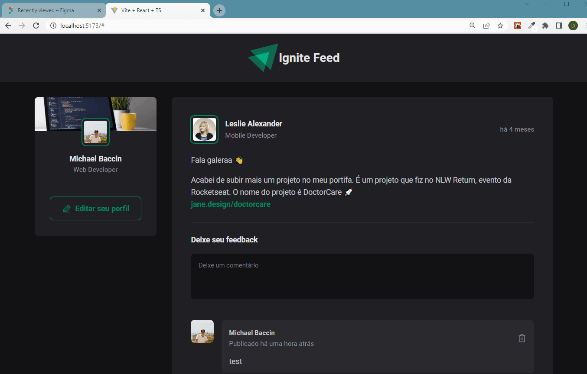
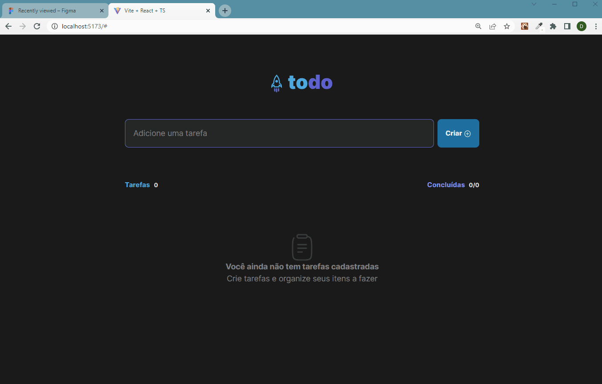

<h1>Estudos Ignite(React) - Etapa 01</h1>
<!-- <h3>Tópicos</h3> -->

<!-- <ul>

<li><a href="#course">Projeto feito durante as aulas</a></li> 
<li><a href="">Projeto do curso feito individualmente</a></li> 

</ul> -->

 

<h2 id="course">Projeto feito durante as aulas</h2>

caminho: "/projects/stage01"

 

    Neste projetos estudamos conceitos básicos de React, como de propriedades e estado, além programação declarativa,
    iteração no com tsx, imutabilidade, typescript, entre outros.

<h3>🚀 Tecnologias</h3>
<ul>
    <li>Vite ts</li>
    <li>Phosphor-react</li>
</ul>

<h3>≠ Diferenças do projeto original</h3>
<ul>
    <li>Usei desde o início o typescript</li>
    <li>Algumas mudanças em estilos, código, entre outros</li>
    <li>Organização de pastas</li>
    <li>Usei o useRef ao invés de useState para pegar o valor da text área</li>
    <li>Etc...</li>
</ul>

 
 

<h2 id="individual-course">Projeto do curso feito individualmente</h2>

caminho: "/projects/practice01"

 

    A Rocketseat disponibiliza as instruções para realizarmos individualmente este projeto, com objetivo de colocarmos em prática o que foi aprendido no primeiro projeto do curso.

<h3>🚀 Tecnologias</h3>
<ul>
    <li>Vite ts</li>
    <li>Tailwind</li>
    <li>Styled-components</li>
    <li>Phosphor-react</li>
    <li>uuid</li>
    <li>headlessui</li>
</ul>

<h3>≠ Diferenças do desafio original proposto</h3>
<ul>
    <li>Criei um modal para editar tasks, utilizando headlessui</li>
    <li>Algumas diferenças em estilização</li>
</ul>

